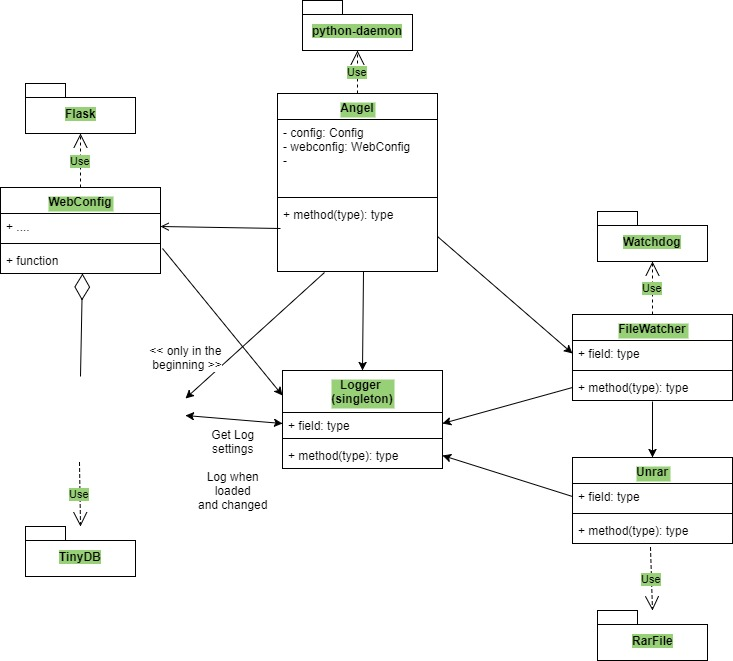

# Unrar angel
A light-weight, highly configurable, unrar daemon.

## Dependencies
- [Watchdog](https://pypi.python.org/pypi/watchdog "Watchdog")
- [TinyDB](http://tinydb.readthedocs.io/en/latest/ "TinyDB")
- [Python unrar](https://github.com/matiasb/python-unrar "rarfile")
- [RARLAB Unrar library](http://www.rarlab.com/rar_add.htm "RARLAB")
- [Flask](http://flask.pocoo.org/ "Flask")
- [Advanced logging example](https://docs.python.org/2/howto/logging.html#configuring-logging "Advanced logging example")
- [Plex.tv server commands](https://support.plex.tv/hc/en-us/articles/201638786-Plex-Media-Server-URL-Commands?mobile_site=true "Plex.tv server commands")

## Roadmap
1. Create the Python daemon.
2. Create a logger.
3. Create a file watcher.
4. Create a settings function by using json.
5. Create the Unrar function inside the file watcher.
6. Create automatically update plex.tv library.
7. Create the website to edit the settings.
8. Create testing framework.
9. Add logging to the website.

## Installation instructions
1. Install Python 3.3-3.6
2. Install watchdog, python-unrar and tinydb with pip
3. Download the latest RARLAB unrar tarball found
[here](http://www.rarlab.com/rar_add.htm "RARLAB library")
called UnRAR source.
4. Follow the instructions
[here](https://help.ubuntu.com/community/CompilingEasyHowTo "Install unrar lib")
to install the latest rar library (Do not forget to move the tarball to /usr/local/src).
5.


```linux
pip3 install watchdog unrar

sudo apt-get install build-essential checkinstall
sudo chown $USER /usr/local/src
sudo chmod u+rwx /usr/local/src
tar -xzvf unrarsrc-5.5.8.tar.gz
cd unrar
make
sudo checkinstall
```

## UML Diagram
Image:




## Special thanks to
- [Sander Marechal for a python daemon implementation](https://gist.github.com/andreif/cbb71b0498589dac93cb "Daemon implementation")
